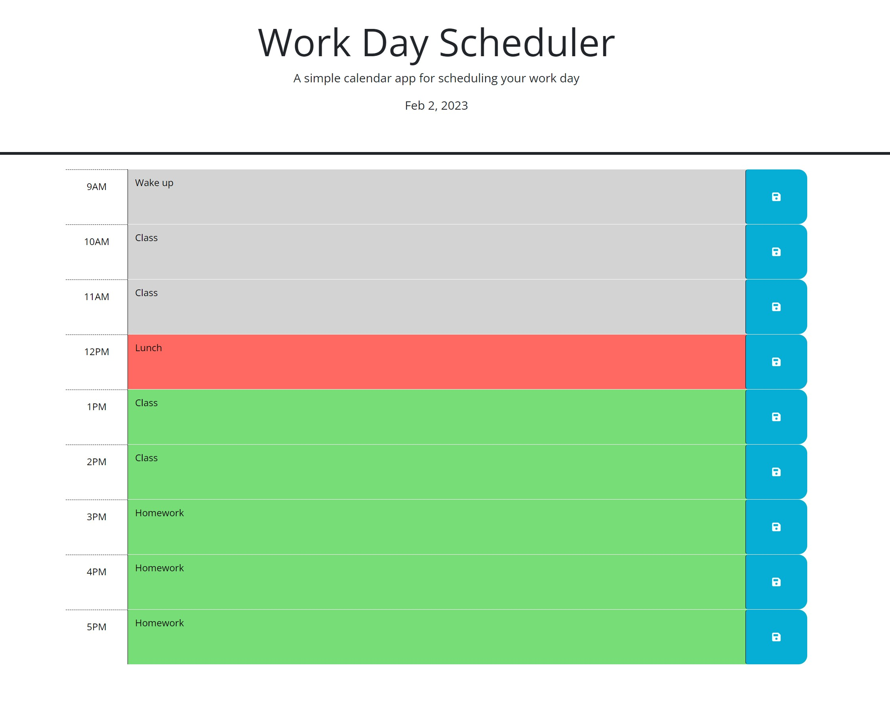

Work Day Scheduler

In this project I created an app that helps schedule a user's work day. Users can enter notes into each hour of their work day and save them to their browser's local storage. I used jQuery in this project to select and modify certain elements of the page. I also used the API dayJs to determine the users time and date. 

